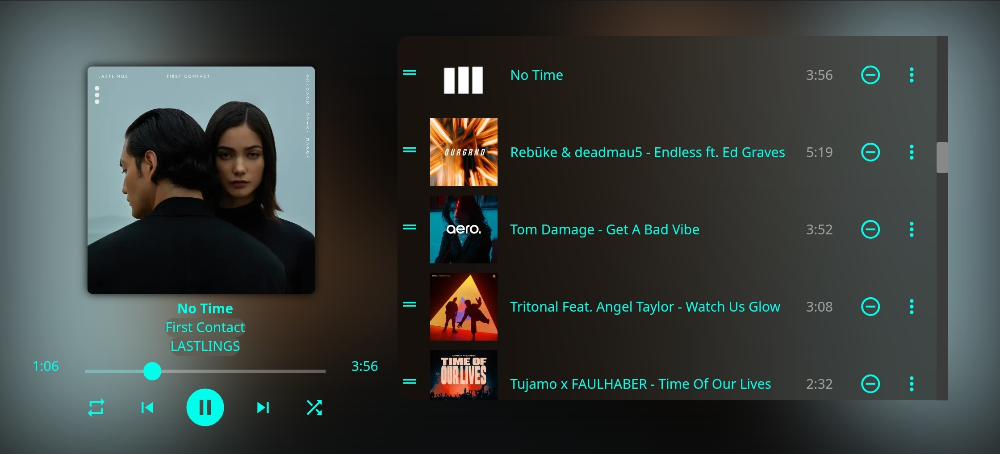

# Theme **STARLIGHT**


This is my theme of Jellyfin and Emby servers, this theme will be tried on Jellyfin 10.10.7.

## CHANGES
- [21/02/2025] Add mod for Jellyfin for music player
- [22/02/2025] Add more blur for white covers and fix brightness and more top space
- [22/02/2025] Add variable position-player values:
  - Inline-end: Player on the right
  - Inline-start: Player on the left
 - [22/02/2025] Add new UI for music player in a phone app
 - [26/02/2025] Fix position of the playlist on phone app, add blur on playlist and buttons of playlist background
 - [27/02/2025] Add style for tablet app, change playlist position on phone app, fix some paddins, fix color for box-check
 - [04/03/2025] More define blur, fix padding playlist on player, fix box when click on time line song, add blur on time song hover, add enfasis color of álbum on player and add blur on volumen control overlay
 - [06/03/2025]
    - Add more easy tutorial to change primary color
    - Add how change wallpaper
    - Add how change position of music player (left or right)
    - Add more responsive UI resize
    - Add music player on landscape for phone app
    - Fix timeline color of mini player and video player
    - Fix size of album image when not image album cover
    - Fix album blur background when not image of album cover
    - Fix tablet format when change position of player
    - Fix tablet format bottons playlist (save playlist and more options)
    - Fix mobile format bottons playlist (save playlist and more options)
- [10/03/2025] Fixed transition to landscape UI to portrait UI, more adjust resize UI and improved landscape mode interface on mobile phones
- [06/04/2025] Fixed background album blur on 10.10.7
- [24/04/2025] Fix when pause song restore original background


## How Install
>[!IMPORTANT]
>If you want background album cover with blur, you need apply [this mod](https://github.com/djmanri3/emby-jellyfin-theme-startlight/tree/main/jellyfin-mods/Player%20Background%20Blur)

Access to **Dashboard**, open **general** settings and add on **Custom CSS code**:
- Jellyfin
  ```
  @import url("https://cdn.jsdelivr.net/gh/djmanri3/emby-jellyfin-theme-startlight@master/Jellyfin.css");
  ```
- Emby
  ```
  @import url("https://cdn.jsdelivr.net/gh/djmanri3/emby-jellyfin-theme-startlight@master/Emby.css");
  ```

More info if you want to install Javascript mod on folder **jellyfin-mods**

## Jellyfin STARLIGHT Mods
- [Player Background With Album Cover](https://github.com/djmanri3/emby-jellyfin-theme-startlight/tree/main/jellyfin-mods/Player%20Background%20Blur)
- [Change Primary Color](https://github.com/djmanri3/emby-jellyfin-theme-startlight/tree/main/jellyfin-mods/Change%20Primary%20Color)
- [Change Position Of Music Player](https://github.com/djmanri3/emby-jellyfin-theme-startlight/tree/main/jellyfin-mods/Change%20Position%20Of%20Player)
- [Change Wallpaper](https://github.com/djmanri3/emby-jellyfin-theme-startlight/tree/main/jellyfin-mods/Change%20Wallpaper)


## Screenshots

### Home Screen
#### Desktop

#### Phone App


### Album Screen
#### Desktop

#### Phone App


### Player Screen
#### Jellyfin
#### Desktop
###### 1. Default


###### 2. With mod

#### Phone App
##### portrait
 

##### Landscape


#### Tablet App


#### Emby

