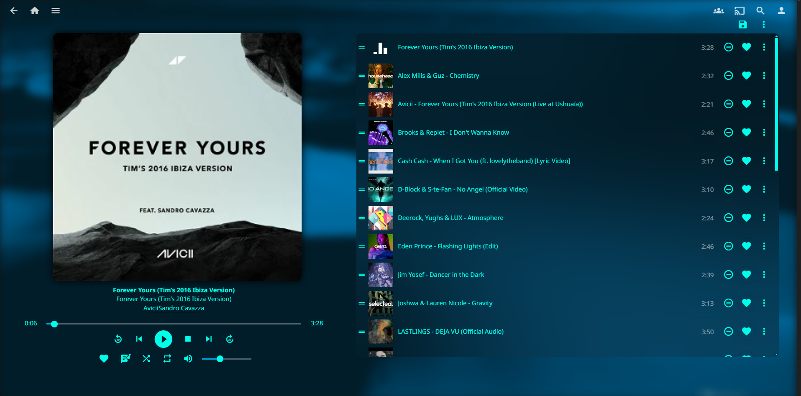
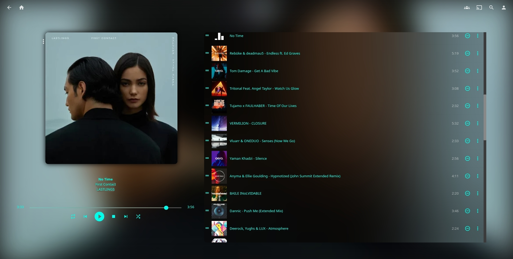

# Theme **STARLIGHT**
This is my theme of Jellyfin and Emby servers, this theme will be tried on Jellyfin 10.10.6.

If you change the primary color of UI, copy all CSS file and modify the CSS var --color to HEX color

## CHANGES
- [21/02/2025] Add mod for Jellyfin for music player
- [22/02/2025] Add more blur for white covers and fix brightness and more top space
- [22/02/2025] Add variable position-player values:
  - Inline-end: Player on the right
  - Inline-start: Player on the left
 - [22/02/2025] Add new UI for music player in a phone app
 - [26/02/2025] Fix position of the playlist on phone app, add blur on playlist and buttons of playlist background
 - [27/02/2025] Add style for tablet app, change playlist position on phone app, fix some paddins, fix color for box-check
 - [04/03/2025] More define blur, fix padding playlist on player, fix box when click on time line song, add blur on time song hover, add enfasis color of álbum on player and add blur on volumen control overlay


## How Install
Access to **Dashboard**, open **general** settings and add on **Custom CSS code**:
- Jellyfin
  ```
  @import url("https://cdn.jsdelivr.net/gh/djmanri3/emby-jellyfin-theme-startlight@master/Jellyfin.css");
  ```
- Emby
  ```
  @import url("https://cdn.jsdelivr.net/gh/djmanri3/emby-jellyfin-theme-startlight@master/Emby.css");
  ```

More info if you want to install Javascript mod on folder **jellyfin-mods**

## Screenshots

### Home Screen
#### Desktop

#### Phone App


### Album Screen
#### Desktop

#### Phone App


### Player Screen
#### Jellyfin
#### Desktop
###### 1. Default


###### 2. With mod

#### Phone App
 

#### Tablet App


#### Emby

