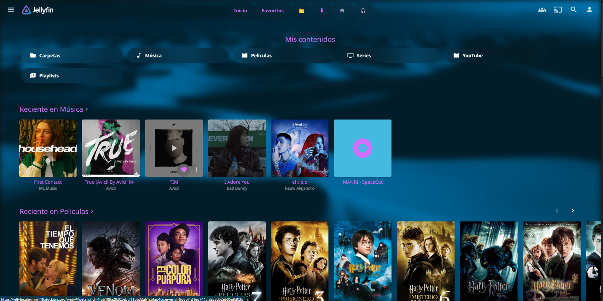

# How Change Primary Color Of Theme

Copy you color do you want on https://htmlcolorcodes.com/ (copy only code that begins with "#")

## Jellyfin
Only copy this code and apply on Dashboard > general settings add on Custom CSS code:
```
@import url("https://cdn.jsdelivr.net/gh/djmanri3/emby-jellyfin-theme-startlight@master/Jellyfin.css");

:root{
  --color: <HEX COLOR>;
}
```

## Emby
Only copy this code and apply on Dashboard > general settings add on Custom CSS code:
```
@import url("https://cdn.jsdelivr.net/gh/djmanri3/emby-jellyfin-theme-startlight@master/Emby.css");

:root{
  --color: <HEX COLOR>;
}
```

## Colors

### Blue Cyan (by default)
```
@import url("https://cdn.jsdelivr.net/gh/djmanri3/emby-jellyfin-theme-startlight@master/Jellyfin.css");

:root{
  --color: #00ffea;
}
```


### Purple
```
@import url("https://cdn.jsdelivr.net/gh/djmanri3/emby-jellyfin-theme-startlight@master/Jellyfin.css");

:root{
  --color: #d370fa;
}
```


### Green
```
@import url("https://cdn.jsdelivr.net/gh/djmanri3/emby-jellyfin-theme-startlight@master/Jellyfin.css");

:root{
  --color: #52B54B;
}
```


### Red
```
@import url("https://cdn.jsdelivr.net/gh/djmanri3/emby-jellyfin-theme-startlight@master/Jellyfin.css");

:root{
  --color: #f56470;
}
```

